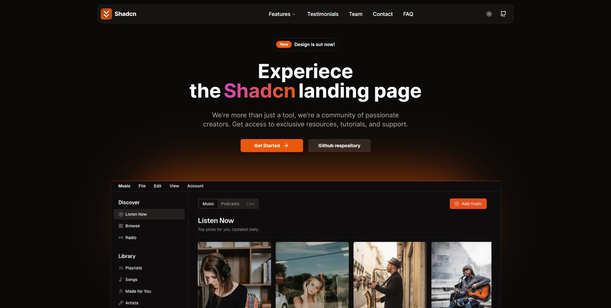

# Radent Landing Page

Radent adalah platform digital berbasis cloud untuk digitalisasi dan otomasi operasional klinik gigi di Indonesia. Landing page ini dibangun menggunakan Next.js, TypeScript, Tailwind CSS, dan komponen Shadcn UI.



## Bagian Halaman

- [x] Navbar
- [x] Hero
- [x] Benefit (Keunggulan)
- [x] Fitur
- [x] Testimoni
- [x] Layanan
- [x] Harga
- [x] FAQ (Pertanyaan Umum)
- [x] Kontak
- [x] Footer

## Fitur

- [x] Desain responsif
- [x] Navigasi mudah digunakan
- [x] Mode gelap & terang
- [x] Komponen modular
- [x] Siap untuk produksi

## Cara Menjalankan

1. Clone repository ini:

```bash
git clone https://github.com/nobruf/radent-landing-page.git
```

2. Masuk ke folder project:

```bash
cd radent-landing-page
```

3. Install dependencies:

```bash
npm install
```

4. Jalankan project:

```bash
npm run dev
```

---

Landing page ini dikembangkan untuk kebutuhan promosi dan informasi produk Radent.
